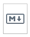

# Erste HTML Seite

## index.html

Die Datei beinhaltet den **Content** der WebSeite.

```
<!DOCTYPE html>
<html lang="en">
...
</html>
```

## README.md

Enthält eine **Projektbeschreibung**, welche dann auf GitHub.com dargestellt wird.



(https://griesmayer.com)